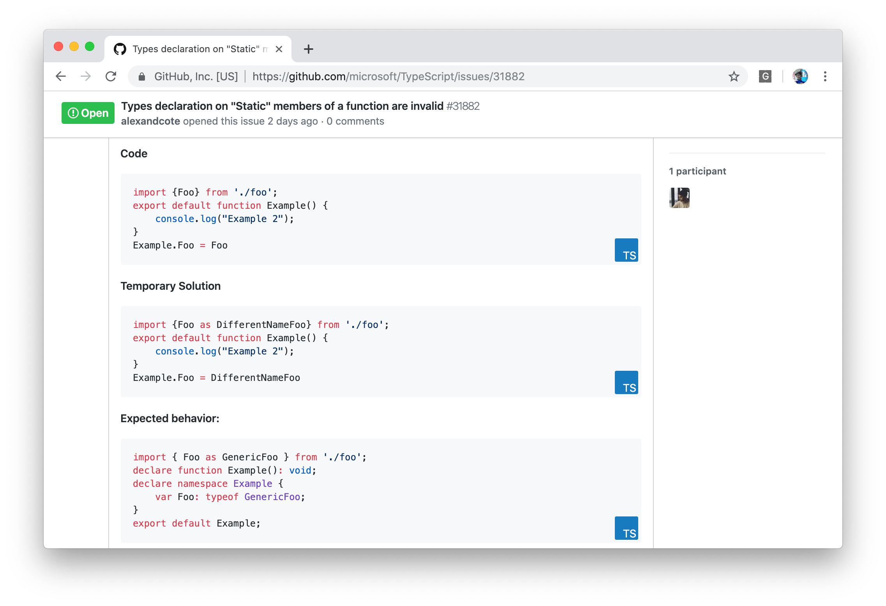
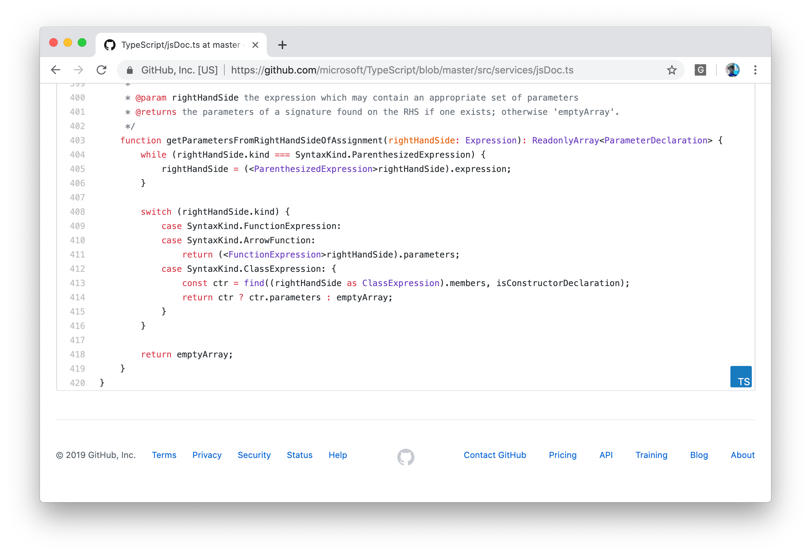

# Add Links to TypeScript Playground in GitHub

A Chromium based extension for sending code to the TypeScript playground.





## Get it

From [the releases page](https://github.com/orta/ts-playgrounds-github/releases)

## Dev Setup

```
yarn install
```

## Build

```
yarn build
```

## Build in watch mode

### terminal

```
yarn watch
```

## Load extension to chrome

Open Chome/Edge/Brave, in the extension settings turn on developer mode, then offer the `dist` directory as an unpacked extension.

