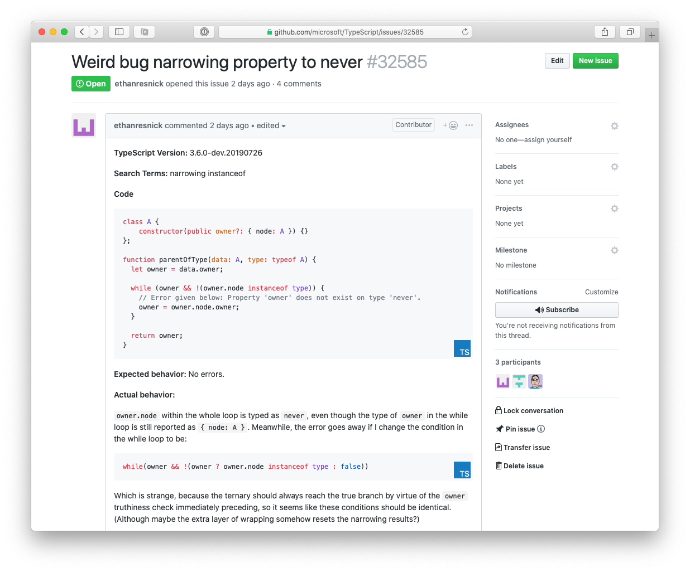

# Add Links to TypeScript Playground in GitHub

A Chromium or Safari extension for sending code to the TypeScript playground.





## Get it

- Chromium: [Chrome App Store](https://chrome.google.com/webstore/detail/github-code-blocks-to-typ/ghfbedglkdlaefbpdammobffadckmjaa/related) or [the releases page](https://github.com/orta/ts-playgrounds-github/releases)
- Safari: [the releases page](https://github.com/orta/ts-playgrounds-github/releases)

## Dev Setup

```sh
yarn install
```

## Build

```sh
yarn build
```

## Build in watch mode

### terminal

```sh
yarn watch
```

## Load extension to chrome

Open Chrome/Edge/Brave, in the extension settings turn on developer mode, then offer the `dist` directory as an unpacked extension.

## Load extension in Safari

open `safari/TS Playgrounds/TS Playgrounds.xcodeproj` and have a look around.
